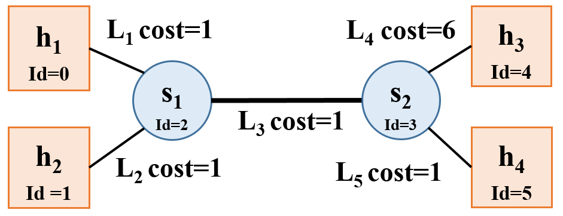

# Video Streaming via CDN

## Overview

Video traffic dominates the Internet. In this project, we will explore how video content distribution networks (CDNs) work. In particular, this project will implement adaptive bitrate selection, DNS load balancing, and an HTTP proxy server to stream video at high bit rates from the closest server to a given client.

### Video CDNs in the Real World
Clients trying to stream a video first issue a DNS query to resolve the service's domain name to an IP address for one of the CDN's content servers. The CDN's authoritative DNS server selects the “best” content server for each particular client based on
(1) the client's IP address (from which it learns the client's geographic location) and
(2) current load on the content servers (which the servers periodically report to the DNS server).

### Video CDN in this Project
This implementation is a simplified version of a CDN. First, the entire system runs on one host and relies on mininet to run several processes with arbitrary IP addresses on one machine. Mininet will also allow you to assign arbitrary link characteristics (bandwidth and latency) to each pair of “end hosts” (processes).


The gray-shaded components in the figure above are implemented

**Browser.** An off-the-shelf web browser (Firefox) will be used to play videos served by the CDN (via your proxy).

**Proxy.** Rather than modify the video player itself, the HTTP proxy implements an adaptive bitrate selection. The player requests chunks with standard HTTP GET requests; your proxy will intercept these and modify them to retrieve whichever bitrate your algorithm deems appropriate. To simulate multiple clients, launch multiple instances of the proxy.

**Web Server.** Video content will be served from an off-the-shelf web server (Apache). As with the proxy, multiple instances of Apache will be run on different IP addresses to simulate a CDN with several content servers.

**DNS Server.** A simple DNS that supports only a small portion of actual DNS's functionality. The server will respond to each request with the “best” server for that particular client.

To summarize, this project has the following components:

* [Part 1](#part1): DNS Load Balancing
* [Part 2](#part2): MiProxy from Homework 2

## Environment Setup
[This VM](http://www.cs.jhu.edu/~hzhu/proj2.ova) has all the components needed to get started on the project. This VM includes mininet, Apache, and all the files we will be streaming in this project. Both the username and password for this VM are `proj2`. To start the Apache server, simply run the python script we provide by doing the following:

`python start_server.py <host_number>`

Here `<host_number>` is a required command line argument that specifies what host you are running on Mininet. This is important as if you're running on h1 in Mininet (which is given the IP address 10.0.0.1), passing in `1` into the `<host_number>` argument will help ensure that the Apache server instance will be bound to the 10.0.0.1 IP address. The `<host_number>` argument must be between 1 and 8.

If you are testing locally, and simply wish to launch the server locally, you can run the following command:

`/usr/local/apache2/bin/apachectl start`

For this project, we will be using an off the shelf browser (in this case, it is Firefox). To launch Firefox for this project, run the following command:

`python launch_firefox.py <profile_num>`

Here `<profile_num>` is a required command line argument that specifies the instance of Firefox you are launching. We support launching profiles 1-8, however, should you feel the need to test more thoroughly, you can launch it with a different number and simply create a new profile as needed. To ensure a separate connection for each instance of Firefox, we recommend that you launch Firefox with a different profile number (otherwise you might notice that different Firefox instances will sometimes share a connection with your proxy browser).

**NOTE:** For this project, we are disabling caching in the browser. If you do choose to create a new profile, please be sure to go to the `about:config` page and set both `browser.cache.disk.enable` and `browser.cache.memory.enable` to `false`.

<a name="part1"></a>
## Part 1: DNS Load Balancing

To spread the load of serving videos among a group of servers, most CDNs perform some kind of load balancing. A common technique is to configure the CDN's authoritative DNS server to resolve a single domain name to one out of a set of IP addresses belonging to replicated content servers. The DNS server can use various strategies to spread the load, e.g., round-robin, shortest geographic distance, or current server load (which requires servers to periodically report their statuses to the DNS server).

You will write a simple DNS server that implements load balancing in two different ways: round-robin and geographic distance. In order for you proxy to be able to query your DNS server, you must also write an accompanying DNS resolution library. The two pieces should communicate using the DNS classes we provide (`DNSHeader.h`, `DNSQuestion.h`, and `DNSRecord.h`). You can read more about what each of the fields in these classes represents [here](http://www.freesoft.org/CIE/RFC/1035/39.htm). To make your life easier:

* `AA` Set this to 0 in requests, 1 in responses.
* `RD` Set this to 0 in all messages.
* `RA` Set this to 0 in all messages.
* `Z` Set this to 0 in all messages.
* `NSCOUNT` Set this to 0 in all messages.
* `ARCOUNT` Set this to 0 in all messages.
* `QTYPE` Set this to 1 in all requests (asking for an A record).
* `QCLASS` Set this to 1 in all requests (asking for an IP address).
* `TYPE` Set this to 1 in all responses (returning an A record).
* `CLASS` Set this to 1 in all responses (returning an IP address).
* `TTL` Set this to 0 in all responses (no caching).

### Round-Robin Load Balancer
One of the ways you will implement `nameserver` is as a simple round-robin based DNS load balancer. It should take as input a list of video server IP addresses on the command line; it responds to each request to resolve the name `video.cs.jhu.edu` by returning the next IP address in the list, cycling back to the beginning when the list is exhausted.

`nameserver` responds *only* to requests for `video.cs.jhu.edu`; any other requests should generate a response with `RCODE` 3.

### Geographic Distance Load Balancer
Next you’ll make your DNS server somewhat more sophisticated. Your load balancer must return the closest video server to the client based on the proxy’s IP address. In the real world, this would be done by querying a database mapping IP prefixes to geographic locations. For your implementation, however, you will be given information in a text file about the entire state of the network, and your server will have to return to a given client its closest geographic server.

The text file will be represented in the following way:
```
NUM_NODES: <number of hosts and switches in the network>
<host_id> <CLIENT|SWITCH|SERVER> <IP address|NO_IP>
(repeats NUM_NODES - 1 times)
NUM_LINKS: <number of links in the network>
<origin_id> <destination_id> <cost>
(repeats NUM_LINKS - 1 times)
```



As an example, the network shown above will have the following text file:
```
NUM_NODES: 6
0 CLIENT 10.0.0.1
1 CLIENT 10.0.0.2
2 SWITCH NO_IP
3 SWITCH NO_IP
4 SERVER 10.0.0.3
5 SERVER 10.0.0.4
NUM_LINKS: 5
0 2 1
1 2 1
2 3 1
3 4 6
3 5 1
```

To operate `nameserver`, it should be invoked as follows:

`./nameserver <log> <port> <geography_based> <servers>`

* `log` The file path to which you should log the messages as described below.
* `port` The port on which your server should listen.
* `geography_based` An integer that will either be 0 or 1. If it is 0, use the round-robin load balancing scheme, otherwise implement the distance based scheme.
* `servers` A text file containing a list of IP addresses, one per line, belonging to content servers if geography_based is 0. Otherwise it will be a text file describing the network topology as explained above.

<a name="part2"></a>
## Part 2: MiProxy Bitrate Adaptation

Many video players monitor how quickly they receive data from the server and use this throughput value to request better or lower quality encodings of the video, aiming to stream the highest quality encoding that the connection can handle. Instead of modifying an existing video client to perform bitrate adaptation, you will implement this functionality in an HTTP proxy through which your browser will direct requests.

The Proxy from [Homework2](https://github.com/etsai7/Computer-Networks/tree/master/Homework2) `miProxy` should listen for browser connections on `INADDR_ANY` on the port specified on the command line. It should then connect to web servers either specified on the command line (see below) or issue a DNS query to find out the IP address of the server to contact (this is covered in part 2).

### Running `miProxy`
To operate `miProxy`, it should be invoked as follows:

`./miProxy <log> <alpha> <listen-port> <dns-ip> <dns-port> [<www-ip>]`

* `log` The file path to which you should log the messages as described below.
* `alpha` A float in the range [0, 1]. Uses this as the coefficient in your EWMA throughput estimate.
* `listen-port` The TCP port your proxy should listen on for accepting connections from your browser.
* `dns-ip` IP address of the DNS server.
* `dns-port` Port number DNS server listens on.
* `www-ip` Your proxy should accept an optional argument specifying the IP address of the web server from which it should request video chunks. If this argument is not present, your proxy should obtain the web server's IP address by querying your DNS server for the name `video.cs.jhu.edu`.

### [Homework 3 Source](https://github.com/xinjin/course-net/tree/master/assignments/assignment3)